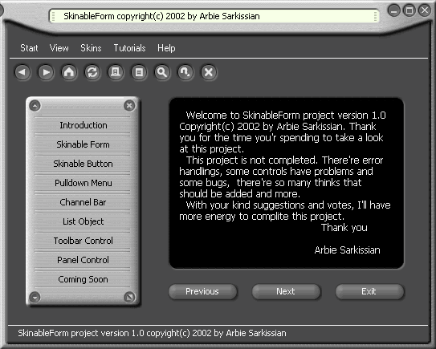



## Skinnable Form \(Updated\) with 5 new skins\!

### Description

Are you tired of chosing Windows environment as your Visual Basic project GUI? This is the time to give your project a look!

This project has several ActiveX controls which gives you the ability of making skinable programs (programs that can change skin such as Winamp), easy as it possible! Simply add the ActiveX control to your project and write only one line of code and then walla... you have a skinable program. Beside that you can chose between several skins that I have made for this project.

Check this out and you'll find that this is all you were looking for in all your programming life! Now this is the time to Make your project a real masterpiece.

Attention: For some problems I couldn't upload my project's skins with the source code, so I upload it with a new name called "Skinable Form Skins". When my problem solves, I will delete the second one and upload all in one.
 
### More Info
 

             |
---                |---
**Submitted On**   |2002-10-11 11:53:24
**By**             |[Arbie Sarkissian](https://github.com/Planet-Source-Code/PSCIndex/blob/master/ByAuthor/arbie-sarkissian.md)
**Level**          |Advanced
**User Rating**    |5.0 (184 globes from 37 users)
**Compatibility**  |VB 6\.0
**Category**       |[Custom Controls/ Forms/  Menus](https://github.com/Planet-Source-Code/PSCIndex/blob/master/ByCategory/custom-controls-forms-menus__1-4.md)
**World**          |[Visual Basic](https://github.com/Planet-Source-Code/PSCIndex/blob/master/ByWorld/visual-basic.md)
**Archive File**   |[Skinnable\_14706810162002\.zip](https://github.com/Planet-Source-Code/arbie-sarkissian-skinnable-form-updated-with-5-new-skins__1-39506/archive/master.zip)

